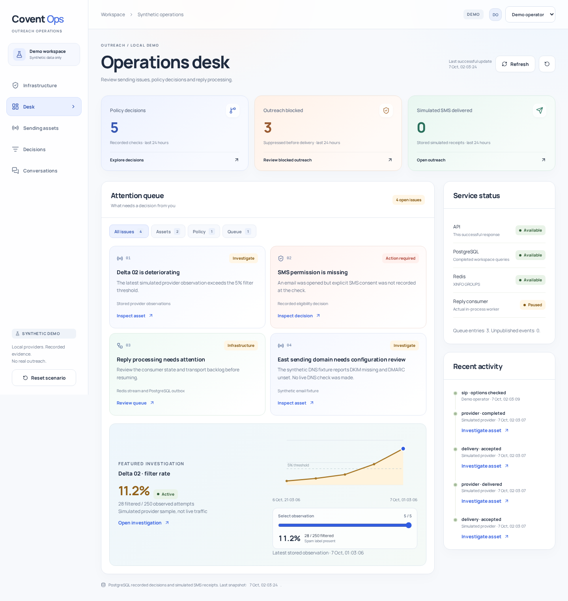

# Covent Ops

An outreach operations desk built around recorded evidence and safe actions. The application uses Go, PostgreSQL, Redis and React with TypeScript.

The signature workflow is a deteriorating sending line: inspect its measured history, quarantine it with an explanation, try restoration, then verify a new clean observation before restoring. The audit trail records both state changes and rejected restoration attempts.



## Run locally

Required: Go 1.26 or newer, Node 22.12 or newer, npm, Make and Docker with Compose. Verification was performed on Arch Linux with Go 1.27.1 and Node 26.10.0. No system package installation is included.

```sh
cd Communication-Infrastructure
make deps
make up
```

Start these in separate terminals:

```sh
make dev-api
```

```sh
make dev-web
```

Open **http://localhost:5173** and choose **Enter as operator**. Choose the reviewer account to explore read-only authorization. The account selector switches between these published synthetic identities.

The default settings are in [.env.example](.env.example). The application reads environment variables, not the file automatically. Defaults work without copying it. If needed, export settings in your shell before starting the API.

| Component | Local address |
| --- | --- |
| Go API and built frontend | `127.0.0.1:2061` |
| Development frontend | `localhost:5173` |
| PostgreSQL demo database | `127.0.0.1:55442` |
| Redis demo transport | `127.0.0.1:56389` |
| Test PostgreSQL / Redis | `127.0.0.1:55443` / `127.0.0.1:56390` |

The containers use their own project volumes. They do not reuse Relay's databases or ports. To stop them without deleting data, run `docker compose stop` in this folder.

## Built frontend

```sh
make build
DEMO_MODE=true INFRA_LAB=true ./bin/ops
```

Open **http://127.0.0.1:2061**. Go serves `web/dist` and the API on the same origin. The Vite proxy is used only during development and preview. Restart an already running API before starting the built binary on the same port.

## Optional iMessage

Enable the separate local Mac bridge simulator with `IMESSAGE_LAB=true make dev-api`, or add `IMESSAGE_LAB=true` to the built startup command above. Choose **iMessage (optional Mac bridge)** in the Infrastructure composer. The default remains disabled. Existing SMS, email and call workflows keep their behavior.

The option includes compatibility checks, durable text jobs, authenticated delivery/read evidence, reply import and STOP suppression. See [the iMessage walkthrough and Mac bridge limits](docs/imessage.md). Real iMessage requires a Mac and separate live integration verification.

## Demonstrate the product

- **Infrastructure:** durable delivery jobs, verified callbacks, provider inbox, line provisioning, SIP resource contracts, a local SIP health probe and an email volume ramp.
- **Desk:** actionable issues, measured metrics, dependency states and recent audit activity.
- **Sending assets:** phone history, quarantine, restoration rules and read-only email configuration fixtures.
- **Decisions:** channel and outcome filters, historical evidence and a scoped CSV export with masked contacts.
- **Conversations:** persisted replies, a real Redis consumer, server-enforced single calling session and SMS consent checks.

Use **Reset scenario** to recreate the synthetic scenarios. Pending or unconfirmed infrastructure jobs block the normal reset. Resolve them first, or explicitly select the additional discard option in the reset dialog to reset this local lab, including unresolved synthetic jobs. The reset requires typing `RESET DEMO`, clears only this synthetic workspace and selects a new Redis namespace. It does not delete other workspaces or databases.

Start with the [infrastructure walkthrough and capability map](docs/infrastructure.md). Follow the original [five-minute desk walkthrough](docs/interview.md) for the asset investigation flow. [Architecture](docs/architecture.md) explains the boundaries and tradeoffs. [API contracts](docs/api.md) describe the actual routes, validation and error behavior.

## Verify

```sh
make check
make test
make build
```

`make test` runs backend integration tests with the race detector, then browser tests sequentially against the isolated test database. Do not run the backend and browser suites concurrently because both deliberately reset test fixtures.

The browser suite needs Playwright's Chromium. If it is not already present, install the project browser with `cd web && npx playwright install chromium`. This downloads a browser, not system packages. Arch Linux must already have its browser runtime libraries.

`make test-unit` runs rules without containers and explicitly skips database integration tests. `npm run format:check` under `web/` checks frontend formatting.

Actual screenshots are in [docs/screenshots](docs/screenshots). Capture the current interface with `node scripts/screenshots.mjs` while the built API is running. Add `--reset-demo` only when you intend to replace the synthetic fixtures first.

Capture the Infrastructure views with `node scripts/infrastructure-screenshots.mjs`. The optional `--add-synthetic-jobs` flag adds two deterministic lab jobs without resetting existing history. Existing contact limits still apply.


See the [domains and SIP view](docs/screenshots/infrastructure-domains.png) and [mobile delivery view](docs/screenshots/infrastructure-mobile.png).

## Scope and limits

Twilio and Resend HTTP adapters run against an isolated local provider lab. The lab simulates outcomes. No live provider credentials are read by the application. DNS inspection uses named local fixtures and checks record presence only. The demonstration DNC list is local and does not verify external registries or legal compliance. SMS requires explicit recorded consent and an inbound reply, never an email open alone.

The schema enforces tenant separation, but the UI exposes one synthetic workspace. The published demo identities demonstrate role checks and session handling, not production login or account recovery. The worker runs in the API process. SIP registration, RTP audio, real spam-label feeds, real mailbox synchronization and Apple business messaging onboarding remain outside the implemented local lab. This project has not been load tested or validated for production deployment.

The reference project was reviewed read-only to understand its approach. No reference source, design or branding was copied. Third-party components and the bundled font retain their [license notices](THIRD-PARTY-NOTICES.md).
