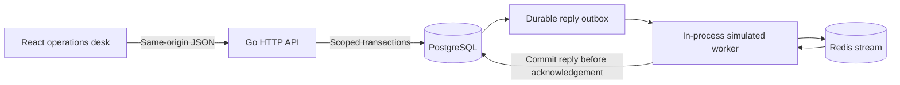

# Architecture

## Boundaries

The new repository had no Go services or frontend. The read-only reference was Python/FastAPI, not the previously described five-service Go stack. This implementation uses one modular Go API rather than inventing those services. PostgreSQL is the source of truth. Redis transports reply events. All provider outcomes are explicitly simulated.

`cmd/ops` owns configuration and process lifecycle. `internal/ops` contains policy rules, transactions, HTTP handlers and the worker. `migrations` defines the database. `web/src/api` holds typed contracts and transport. `web/src/components` contains the five product views and their investigation panels.

## Identity and tenant separation

A random 256-bit session token is stored as a SHA-256 hash. Its cookie is HttpOnly with SameSite Strict and an eight-hour lifetime. Local HTTP has no Secure cookie flag; a TLS request sets it. Identity and role come from the server session, never mutation input. Published operator and reviewer identities are intentional demo accounts.

Every tenant table has forced row-level security. A transaction sets `app.workspace_id` from the resolved session. The runtime role cannot bypass RLS. Composite foreign keys prevent cross-workspace associations. RLS depends on the API assigning the trusted workspace; it does not restrict someone who already holds runtime database credentials. Tests query without tenant predicates to verify the database boundary.

Read endpoints use repeatable-read transactions for a coherent PostgreSQL snapshot. A separate shared advisory lock protects operations against a concurrent demo reset. Reset takes the exclusive lock and deletes only records visible to the fixed demo workspace. Asset versions increase across resets, so stale asset changes are rejected.

Mutations require a trusted local Origin and loopback Host. Requests accept known JSON fields only and have a 16 KiB body limit. Production HTML uses a fresh CSP nonce for dialog styles. Scripts, fonts and API requests remain on the same origin. React renders user-provided text without HTML insertion.

## Safe line transitions

Quarantine and restore lock the asset row and check its version. Changes and audit inserts commit in one transaction. A failed audit insert rolls back the state change. Repeating an action that already reached its target returns `changed: false` without another audit entry.

An active call prevents changes to its source line. Restoration requires an observation newer than quarantine, at least 20 measured attempts, a filter rate no greater than 5% and no spam label. These are demonstration rules, not a provider guarantee. The clean sample action inserts a simulated observation. It does not reset history or override the gate. Rejected restoration is audited.

Email fixtures expose SPF, DKIM, DMARC and warmup age. State transitions and live DNS updates are not implemented for email assets.

## Outreach safeguards

DNC and opt-out suppression apply to calls, SMS and infrastructure email jobs. SMS additionally requires a recorded consent timestamp, a consent source and an inbound reply. Email opens do not qualify. Infrastructure email requires explicit recorded email permission. The server caps combined outreach attempts at three per contact in 24 hours. A contact row lock serializes this check.

Calling uses a workspace advisory lock and a partial unique index for one active call. Its six-second simulated deadline is completed by the worker. The exact completion time depends on worker availability. No automated call retry occurs.

Calls and SMS require a request key. A transaction locks that key and stores the request hash with the result. An identical replay returns the original result. Different input with the same key returns a conflict. Decisions, simulated receipts and audit events commit together. The browser sends each action once and asks the operator to inspect recorded state after an ambiguous failure.

Historical decisions contain an evidence snapshot. Current contact edits do not change it. The runtime role cannot update decisions or audit records. The isolated reset can delete demo history, so this is not a permanent compliance archive.

## Reply delivery and recovery

Synthetic reply events first exist in the PostgreSQL outbox. The worker publishes them to a generation-specific Redis stream. A group starts at the beginning of that stream. Events are persisted as replies with a unique event ID before Redis acknowledgement. Replays cannot create a second reply or repeat its audit event. Inbound `STOP` applies opt-out suppression in the same persistence transaction.

A crash between Redis publication and the PostgreSQL update can publish an event again. This is at-least-once transport, not exactly-once delivery. Unique reply IDs make persistence idempotent. `XAUTOCLAIM` recovers abandoned pending events after two seconds. The demo pause suspends consumption but keeps publication and durable events available.

Queue visibility reports Redis pending entries plus group lag and a separate unpublished outbox count. These are transport entries, not a count of unique business replies. Redis errors produce `pending: null` with an unavailable state. PostgreSQL failures return an error. Neither becomes an empty list or a zero backlog.

Reset increments the database generation atomically. Old Redis streams are retained rather than deleted. This avoids a cross-database destructive operation but leaves small old demo namespaces behind. It is a deliberate local-demo limitation.

## Browser behavior and privacy

Polling starts its next request only after the previous one finishes. Hidden tabs pause refreshes. Abort controllers and request generations prevent stale responses from overwriting newer state. Background failures preserve usable records and expose a stale warning. The UI shows the time of the last successful response.

Overview contacts, decision evidence and CSV exports are masked. Free-form audit explanations are omitted from the desk and remain in authorized asset details. Contact detail workflows intentionally display the full synthetic values. Contact details and message bodies are never application log fields. CSV text that could begin a spreadsheet formula is neutralized.

The UI uses a left navigation rail, a numbered attention queue and linked evidence panels. Light surfaces, blue actions and restrained pastel cards establish the visual hierarchy. Metric shortcuts open the relevant decision scope. Queue filters operate on recorded issues. The chart selector exposes an observation without changing the latest server evidence. Search icons occupy a separate grid column; clear controls and Escape preserve input focus. Manrope is bundled locally with its OFL license. Page entrance motion runs only when the section changes, so background refreshes preserve focus and layout. Radix supplies dialog focus containment and Escape behavior. Investigation panels slide in with short transitions. Wide tables scroll locally. Reduced-motion settings disable animation and transitions.

## Before a live deployment

Production identity, organization management, provider account activation, consent policy review, queue retention, dead-letter handling, independent worker lifecycle, monitoring, backup recovery and load testing would need separate implementation and verification. Provider HTTP adapters are implemented and verified against a local lab. Live activation and production identity remain disabled. See [Infrastructure](infrastructure.md) for delivery state transitions, webhook verification and the current channel boundaries.

## Delivery infrastructure

`internal/provider` owns Twilio and Resend wire contracts, signature verification, DNS inspection and the local SIP responder. `internal/ops/delivery.go` owns authorization, consent checks, durable jobs and bounded retry. `delivery_events.go` verifies and persists provider evidence. The existing Redis reply workflow remains separate from direct provider inbox ingestion.

A job commits before its network request. Workers claim queued jobs with `FOR UPDATE SKIP LOCKED` and a durable submission lease. Requests happen outside the transaction. An expired submission lease becomes unknown. Only a definite HTTP 429 schedules another attempt, up to three attempts. Timeouts, 5xx responses and malformed successful responses stay unknown. Provider acceptance is separate from delivery.

Callbacks authenticate the exact canonical URL and form or raw JSON body before applying changes. Event IDs deduplicate persistence. Late events are retained without regressing a terminal state. Bounce and complaint events suppress future outreach even after an earlier delivered event. Inbound replies and opt-outs commit together. Email bodies are retrieved through the receiving API and rendered as text.

The old dialer and infrastructure dialer share the workspace call lock. Queued, submitting, accepted and unknown infrastructure calls reserve the slot. Quarantine rejects busy call assets. Consent and suppression are checked again immediately before submission. A STOP event after an external provider has already accepted a request cannot recall that request.

The local lab runs a separate HTTP server and an OPTIONS-only UDP SIP peer. Provider identities are in memory; application jobs and events are in PostgreSQL. After a lab restart, an unresolved provider record may no longer be available. The application reports that loss, never fabricates verification. The explicit local reset can discard unresolved synthetic records. Live mode is prohibited at startup.

The optional iMessage adapter routes through a separate authenticated Mac bridge contract. It has independent permission records, checks an existing iMessage chat before submission and pulls reply and delivery evidence rather than accepting unsigned webhooks. The original providers keep their default routing. See [the iMessage architecture and limits](imessage.md).
