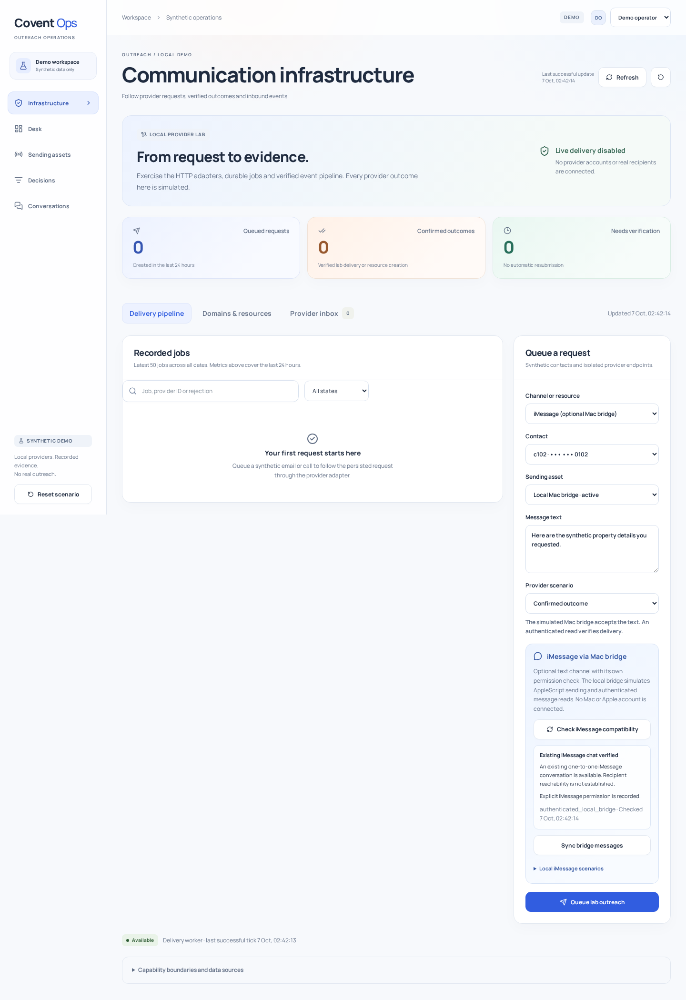

# Optional iMessage channel

The existing SMS, email, calls and resource workflows retain their defaults. iMessage is an additional text channel, disabled until its local bridge lab is enabled. No Mac, Apple account or real recipient is connected by these commands.



The [mobile screenshot](screenshots/imessage-mobile.png) shows the same controls at 390 pixels. Reproduce both captures with `node scripts/imessage-screenshots.mjs` while the built API runs with the option enabled. The capture script checks compatibility without submitting a message or resetting data.

## Run and demonstrate

Start the usual PostgreSQL and Redis containers with `make up`. Start the API with:

```sh
IMESSAGE_LAB=true make dev-api
```

Start `make dev-web` in a second terminal. Open `http://localhost:5173/#infrastructure` and enter as operator. For the built application, use:

```sh
make build
DEMO_MODE=true INFRA_LAB=true IMESSAGE_LAB=true ./bin/ops
```

1. Choose **iMessage (optional Mac bridge)** in **Channel or resource**. Use contact c102 and the Local Mac bridge asset.
2. Select **Check iMessage compatibility**. The authenticated bridge lookup confirms an existing iMessage chat and the server reports separate iMessage permission. Sending stays disabled until both checks pass.
3. Queue the synthetic text. Inspect its job: provider acceptance is followed by a delivery timestamp obtained through an authenticated bridge read. The source is `authenticated_local_bridge`, not a signed webhook.
4. Expand **Local iMessage scenarios** and simulate a read receipt. Inspect the job again to see the recorded read timestamp. A delivery receipt alone never implies a read.
5. Simulate an iMessage reply and inspect it in **Provider inbox**. Repeated synchronization imports each provider message once.
6. Simulate iMessage STOP. Further iMessage, SMS, call and email outreach to c102 is suppressed. The server also rechecks suppression before dispatching queued jobs.

Choose c101 and check compatibility to see the absent-chat state. A reviewer can check compatibility and inspect records, but cannot send, sync or generate provider scenarios. A normal demo reset also resets this optional bridge's in-memory history after a successful database commit.

The shared limit of three outreach attempts per contact in 24 hours also applies to iMessage. Existing demo history may trigger a server rejection. Use the explicit synthetic reset when you intend to start a fresh scenario. Disabling the option preserves queued iMessage jobs until the bridge is enabled again; other channels continue processing.

## What compatibility establishes

The bridge returns the exact existing one-to-one chat GUID and identifies its service as iMessage. The adapter accepts only `iMessage;-;` chat identifiers. It does not create chats or route through `any` identifiers. The adapter never requests an SMS channel and treats non-iMessage submission results as unconfirmed. Mac routing behavior remains unverified. This deliberately narrow contract does not cover every BlueBubbles chat format.

An existing chat does not establish that a recipient currently has iMessage enabled or can receive a message. No general phone-number capability lookup is implemented. Compatibility and explicit permission are separate checks, and compatibility is checked again by the adapter before submission.

## Mac bridge adapter

`internal/provider/bluebubbles.go` implements a narrow part of the [BlueBubbles REST API](https://docs.bluebubbles.app/server/developer-guides/rest-api-and-webhooks), checked against its [upstream router and validator source](https://github.com/BlueBubblesApp/bluebubbles-server/tree/master/packages/server/src/server/api/http/api/v1). No upstream source was copied into the application.

| Bridge route | Purpose |
| --- | --- |
| `GET /api/v1/chat/{guid}` | Check exact chat identity and iMessage service |
| `POST /api/v1/message/text` | Submit `{ chatGuid, tempGuid, message, method: "apple-script" }` |
| `GET /api/v1/message/{guid}` | Inspect known message identity, delivery/read timestamps and error code |
| `GET /api/v1/chat/{guid}/message?limit=100&sort=DESC` | Import the latest 100 text records from that chat |

The server password is held by the adapter and supplied using the bridge's documented query authentication. It is never sent to the browser or logged by this application. Transport requires HTTPS or loopback HTTP, rejects redirects and uses bounded response bodies and timeouts. Bridge deployment logs must also redact credential query parameters.

The application persists jobs before submitting. `tempGuid` correlates the request; it is not treated as durable provider deduplication across bridge restarts. Ambiguous submissions are never retried automatically. A known provider GUID can be inspected again. Without one, verification requires inspecting the Mac rather than guessing a matching message.

Incoming messages and receipts are pulled through authenticated API requests. Unsigned bridge webhooks cannot alter application state. Inbound content is bounded and displayed as plain text. Repeated imports and read receipts are deduplicated. No receipt or inbound message grants iMessage permission.

## Application API

| Route | Authorization and behavior |
| --- | --- |
| `GET /api/v1/imessage/compatibility?contactId={id}` | Both roles. Returns configuration, availability, permission reason and check timestamp for a workspace contact |
| `POST /api/v1/infrastructure/jobs` | Operator. Existing job contract with `channel: "imessage"` and `assetId: "bridge-imessage"` |
| `POST /api/v1/imessage/sync` | Operator. `{ contactId }`. Imports recent replies and inspects known outbound resources; dependency failure returns an error |
| `POST /api/v1/imessage/scenarios` | Operator and local lab only. `{ kind: "reply", body }` or `{ kind: "read" }` |

## Limits and live prerequisites

Ordinary iMessage requires a Mac with Messages activated. [BlueBubbles documents its macOS dependency](https://docs.bluebubbles.app/server). The adapter uses its AppleScript path, not the optional private API helper. It is a third-party bridge rather than an Apple business messaging API. Apple Messages for Business is a separate channel and is not implemented here.

The runnable application remains synthetic and does not read live bridge credentials. `NewBlueBubbles` is the integration boundary for a future identity-protected deployment. Adding a bridge URL to this demo does not activate real sends. Live Mac compatibility, delivery and read receipts have not been verified. Attachments, groups, reactions, typing indicators, arbitrary chat discovery and automatic full-history synchronization are outside this implementation.

Backend tests passed with the race detector and cover the wire contract, disabled mode, channel-specific permission, tenant boundaries, delivery/read evidence, STOP, replay handling and reset consistency. All 29 browser tests passed, including the original 26 workflows and three optional-channel checks. Type checking, frontend formatting and the production build passed.
