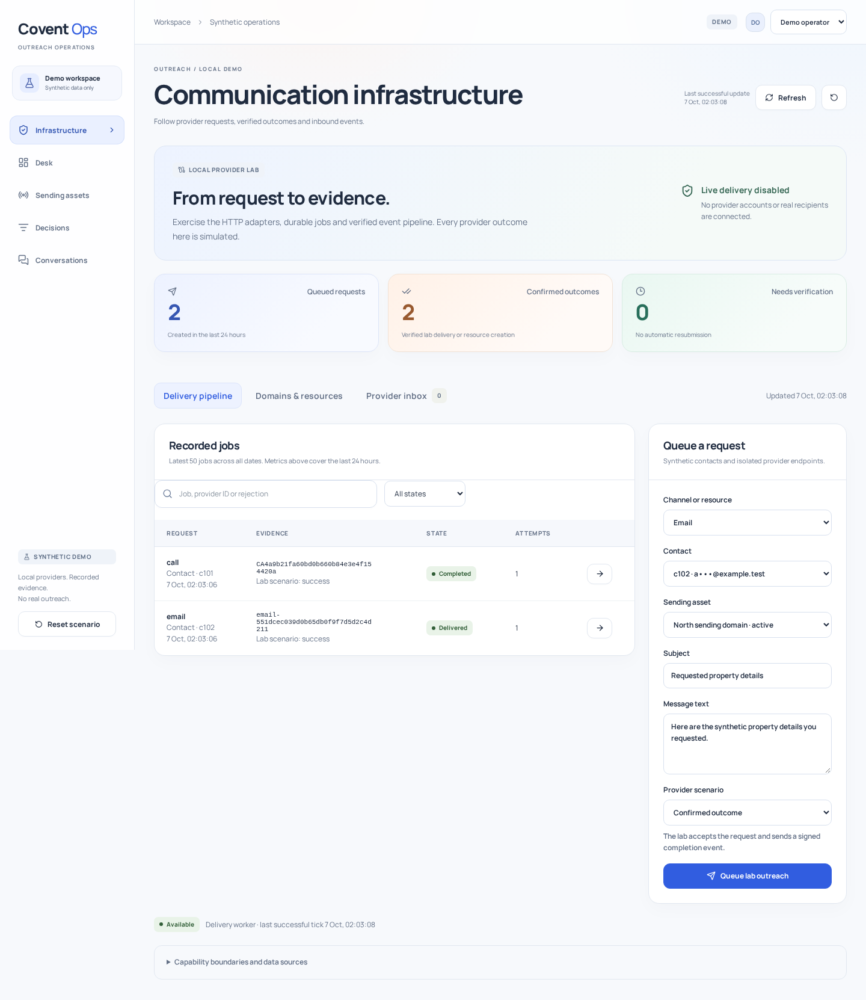
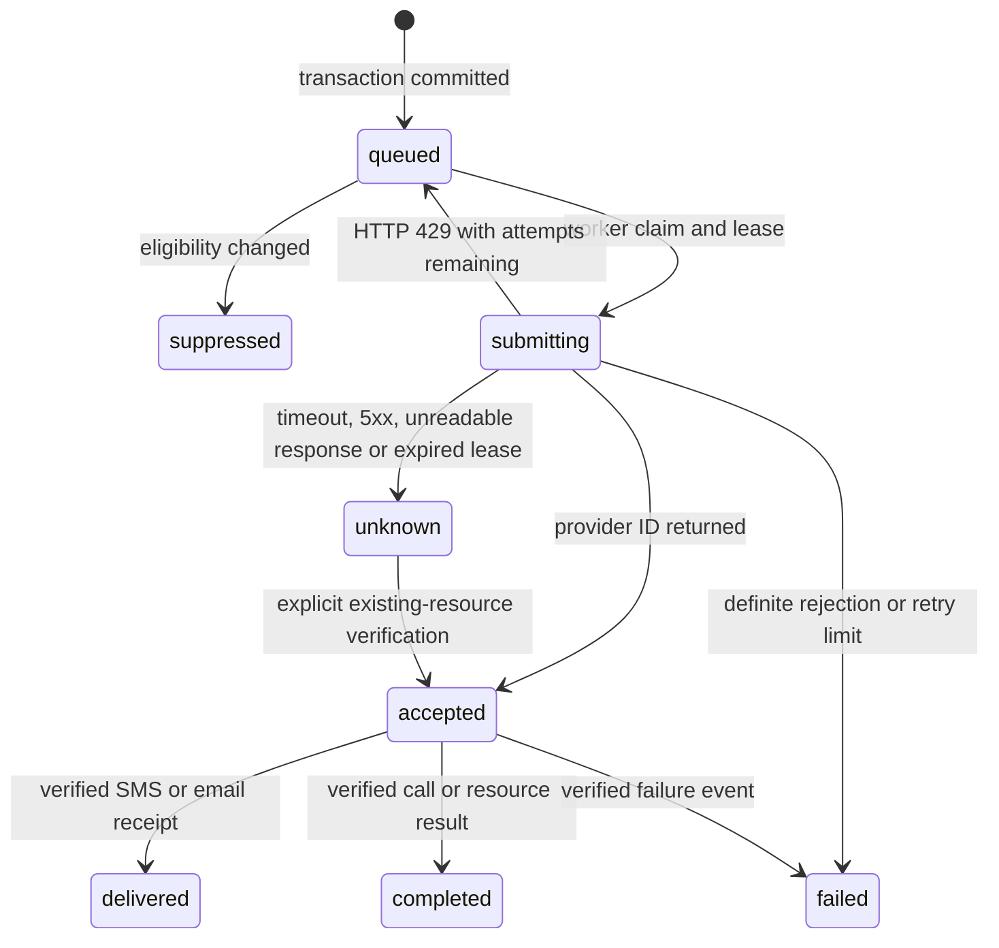

# Communication infrastructure

Run `make up`, `make dev-api` and `make dev-web`, then open `http://localhost:5173/#infrastructure`. Choose the operator account. The API starts its provider lab when `INFRA_LAB=true`, as configured by `make dev-api`. Existing dependencies are sufficient.

For the built interface, run `make build`, then `DEMO_MODE=true INFRA_LAB=true ./bin/ops`. Open `http://127.0.0.1:2061/#infrastructure`.

The [domains and SIP view](screenshots/infrastructure-domains.png) and [mobile view](screenshots/infrastructure-mobile.png) are captures of the running application. To reproduce them, run `node scripts/infrastructure-screenshots.mjs` from the repository root while the built API is running. The optional `--add-synthetic-jobs` flag adds a deterministic email and call through the normal API. It preserves existing history and respects contact limits.

## What you can demonstrate

| Capability | Implemented behavior | Boundary |
| --- | --- | --- |
| SMS | Twilio HTTP adapter, durable jobs, consent checks, verified receipts, inbound STOP and suppression | Synthetic endpoints and recipients. No real cold SMS |
| Calls | Operator-first TwiML bridge contract, one reserved call per workspace, signed completion and ambiguity handling | No PSTN connection or audio in the lab |
| Phone health | Timestamped SMS receipt counts and filtering events feed asset observations | No external spam-label monitoring feed. Receipt processing preserves the existing label rather than claiming to clear it |
| Provisioning | Twilio number creation contract, provider ID persistence and a new asset after confirmation | Lab resource creation only. No number is purchased |
| SIP | Secure trunk creation contract and a real UDP OPTIONS exchange with a local peer | No SIP registration, origination routing, TLS test or RTP media |
| Email | Resend submission with idempotency keys, signed delivery/bounce/complaint events and receiving API content retrieval | Outcomes and mailboxes come from the local provider lab |
| Deliverability | DNS record inspection logic, explicit missing/unavailable states and recorded failure evidence | Runtime uses DNS fixtures. Record presence does not prove authorization, alignment or inbox placement |
| Volume ramp | Scheduled updates to explicitly opted-in recipients, daily caps, request deduplication and automatic pause on bounce/complaint | No manufactured engagement or claim of reputation improvement |
| Inbox | Verified SMS/email replies, authorized plain-text detail, resolution conflicts and audit entries | No Gmail/Outlook sync, attachments or full conversation threading |
| Protection | Roles, forced RLS, verified callbacks, suppression, quotas, masking and conservative retries | Production identity and external DNC integration are still required |
| iMessage | Optional BlueBubbles adapter, existing-chat compatibility checks, delivery/read evidence, imported replies and STOP suppression | Local Mac bridge simulation. Real Mac transport is unverified. See [the iMessage walkthrough](imessage.md) |

## Five-minute walkthrough

1. **Delivery pipeline:** queue the default email to c102. Observe queued or submitting followed by delivered. Open the job, inspect its provider ID and signed event, then open its eligibility decision.
2. Change to **Operator-assisted call** and choose **Ambiguous submission**. The job becomes unknown with one attempt. Another call is blocked. Open the job and select **Verify existing lab record**. An authenticated lookup and signed callback confirm the existing resource without another submission.
3. **Provider inbox:** simulate an email reply. Open it and mark it resolved. Simulate SMS STOP, then try SMS to c102. The server rejects it and links to its recorded decision. Reset the local scenarios before another consented-send demonstration.
4. **Domains & resources:** inspect North's DNS fixture and enable its volume ramp. One deduplicated update is scheduled for the opted-in test contact. Pause the ramp. Explain that its daily cap is a volume control, not a deliverability score.
5. Probe the SIP peer. Show the matched `200 OK`, measured round-trip time and timestamp. Explain the distinction between signaling response, a trunk resource and actual audio connectivity.

Use the throttle scenario to demonstrate a definite rejection followed by a bounded retry. Use a filtered SMS to create a recorded filter observation, or an email bounce to demonstrate suppression. These events are all explicitly simulated.

## Job states and recovery

The maximum is three submission attempts. No timer turns an infrastructure call into an answered call. A submitted call remains reserved until its result is verified. The original Conversations demonstration still has its earlier timer-based simulation and is labeled separately.

Late callbacks remain evidence but do not regress terminal job status. A later bounce or complaint still suppresses the contact. Request identity is scoped to workspace and actor. Reusing a successful job key with changed input returns a conflict. Blocked eligibility checks create decisions but do not create provider jobs.

The local provider lab keeps its resources in memory. PostgreSQL retains application records across restarts. Verification after a lab restart may report that the original provider resource is unavailable. Normal reset protects unresolved jobs. The reset dialog offers an explicit additional discard option for this isolated synthetic workspace. That option is not a production reconciliation strategy.

## API additions

All `/api/v1/infrastructure` routes require a session. POST routes also require an operator and the existing Origin checks. JSON requests reject unknown properties. Times use RFC 3339 UTC.

| Route | Contract |
| --- | --- |
| `GET /infrastructure` | Latest 50 jobs, latest 30 inbox entries, assets, masked contacts, DNS records, ramps, SIP observation, worker status and 24-hour job metrics. Failed reads return an error |
| `POST /infrastructure/jobs` | `{ channel, contactId?, assetId?, requestKey, subject?, body?, destination?, scenario?, purpose? }`. Channels: sms, call, email, provision, trunk. Returns 202 for a queued job, 200 for an identical replay, 409 for conflict or 422 for a recorded eligibility rejection |
| `GET /infrastructure/jobs/{id}` | Masked job and verified event history, including source and occurrence/receipt timestamps |
| `POST /infrastructure/jobs/{id}/verify` | `{ confirmation: "VERIFY LAB RECORD" }`. Reads the existing lab resource and applies its confirmed state. Does not submit outreach |
| `POST /infrastructure/scenarios` | `{ channel: "sms" or "email", contactId, assetId, body }`. Generates a signed local inbound event |
| `GET /infrastructure/inbox/{id}` | Authorized plain-text body, subject, contact, state and version |
| `POST /infrastructure/inbox/{id}/resolve` | `{ expectedVersion }`. Atomic state and audit update. Conflicting versions return 409 |
| `POST /infrastructure/dns/{assetId}` | `{ selector: "mail" }`. Inspects and records named DNS fixtures. Does not query an external domain |
| `POST /infrastructure/ramps/{assetId}` | `{ enabled }`. Enabling requires recent SPF, DKIM and DMARC fixture records |
| `POST /infrastructure/sip/probe` | `{}`. Measures a local OPTIONS response and persists its evidence |

Provider routes are `/hooks/twilio/status?job={id}`, `/hooks/twilio/inbound` and `/hooks/resend`. They require provider signatures instead of browser Origin authentication. Twilio validation uses the configured canonical origin. Resend validation verifies the raw body, event ID and a timestamp within five minutes. Bodies are bounded. A failed verification cannot modify records.

## Before connecting provider accounts

Live startup is intentionally disabled because the current identities are published demo accounts. A production release still needs a separate environment, production identity, secrets management, verified sending assets, provider-approved usage, test recipients, TLS webhook endpoints, retention policy, operational monitoring, backup recovery and deployment validation. Credentials alone are not sufficient. No live delivery, cost, throughput, legal compliance or inbox placement has been demonstrated.

Replace the narrow form-only Twilio signature implementation with the provider-supported SDK before broad live webhook support. The local implementation is tested against Twilio's published Go signature fixture and rejects unconfigured callback origins. It does not implement every webhook content type or proxy topology.

Provider contracts were checked against [Twilio messages](https://www.twilio.com/docs/messaging/api/message-resource), [calls](https://www.twilio.com/docs/voice/api/call-resource), [phone numbers](https://www.twilio.com/docs/phone-numbers/api/incomingphonenumber-resource), [SIP trunks](https://www.twilio.com/docs/sip-trunking/api/trunk-resource) and [webhook security](https://www.twilio.com/docs/usage/webhooks/webhooks-security). Email contracts follow [Resend sending](https://resend.com/docs/api-reference/emails/send-email), [receiving](https://resend.com/docs/api-reference/emails/retrieve-received-email) and [Svix verification](https://docs.svix.com/receiving/verifying-payloads/how-manual). Apple's [Messages for Business documentation](https://support.apple.com/en-us/102053) describes customers starting conversations.

## Verification

Verification completed on the local build: all 29 browser tests passed including the optional iMessage extension, backend unit and PostgreSQL/Redis integration tests passed with the Go race detector, and Go vet, TypeScript checking, frontend formatting and the production build passed. The browser suite covers signed outcomes, ambiguity recovery, STOP suppression, DNS gates, volume scheduling, SIP evidence, reviewer authorization, keyboard access and populated mobile tables. These results establish local behavior, not live provider delivery or production capacity.

## Questions to prepare for

- **Why retain unknown states?** A network failure cannot establish whether the provider accepted an operation. Resending may duplicate a call, message or purchased resource.
- **Why PostgreSQL for delivery jobs?** The eligibility evidence, job and audit can commit together. Row locks coordinate workers. Redis remains responsible for the existing reply-stream workflow.
- **Why recheck consent at dispatch?** A contact can opt out after a job is queued. This blocks queued work, but cannot recall an operation already accepted externally.
- **Why is accepted different from delivered?** The submission API creates a provider resource. A later authenticated event establishes its outcome.
- **What does the SIP check prove?** A local UDP peer answered the exact OPTIONS request. It says nothing about RTP audio or a real carrier route.
- **What remains to prove?** Real provider behavior, approved usage, production operations and deliverability under actual traffic.
