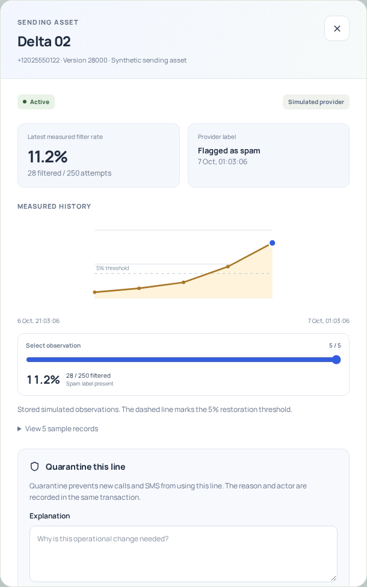
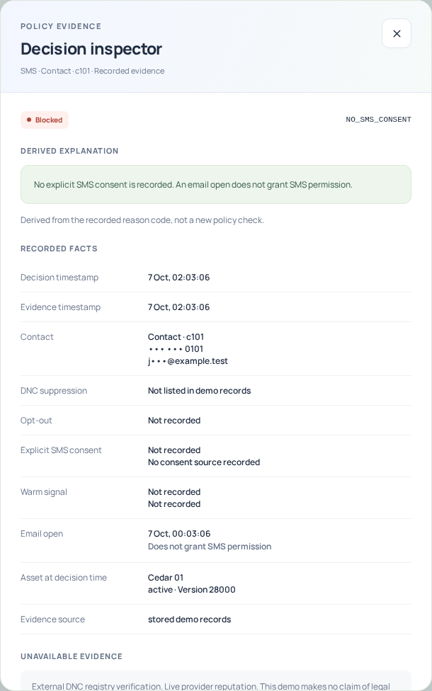
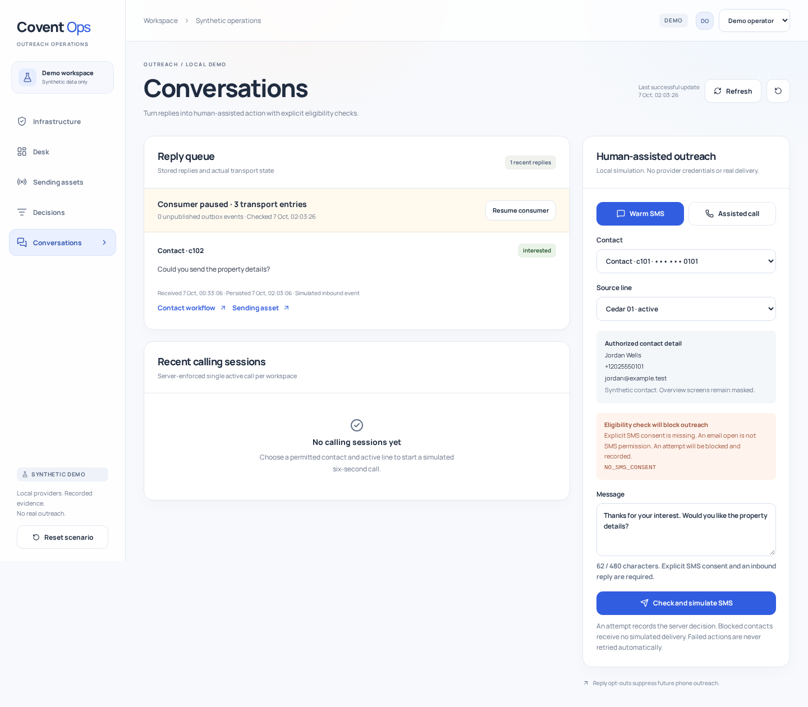

# Five-minute demonstration

For the new provider pipeline demonstration, use the [infrastructure walkthrough](infrastructure.md#five-minute-walkthrough).

Start the local app and enter as operator. Reset the synthetic scenarios if needed. Explain that providers and contacts are simulated while PostgreSQL, Redis, sessions and policy checks are real.

| Time | Show | Explain |
| --- | --- | --- |
| 0:00–0:45 | Desk and Delta 02 | The latest sample contains 28 filtered attempts out of 250, or 11.2%. Counts come from stored observations. The queue leads to action rather than a decorative score. |
| 0:45–2:15 | Inspect Delta 02, quarantine with a reason and attempt restoration | The state change and audit insert are atomic. Restoration is rejected because the observation predates quarantine and fails the health rules. The rejection is audited. |
| 2:15–2:45 | Record a clean demo sample, explain restoration and restore | This inserts a new observation. It does not erase the old history or bypass validation. The server verifies the rules again and records the actor. |
| 2:45–3:45 | Conversations, c101, Check and simulate SMS, inspect rejection | The contact opened an email but has no explicit SMS consent. The attempt is blocked before delivery. Recorded facts, the derived explanation and unavailable external verification are separate. |
| 3:45–4:30 | Choose c102 and simulate SMS, then try an assisted call | This contact has a synthetic opt-in and inbound reply. Calling shows a busy state until the worker records the outcome. The database enforces one active call. |
| 4:30–5:00 | Resume the reply consumer, inspect STOP, switch to reviewer | Real Redis entries become persisted replies. STOP applies phone suppression. The reviewer can investigate but cannot mutate through either the UI or API. |

Choose the two primary workflows if time is short. The backend tests also demonstrate concurrency, replay protection and tenant isolation without consuming interview time.

## Engineering decisions to defend

**Why a modular Go API instead of five microservices?**

There were no existing Go services to preserve. One process makes a focused interview demo reproducible. Policy, persistence, transport and presentation still have clear boundaries. Independent worker deployment would be a later operational change.

**Why PostgreSQL and Redis together?**

PostgreSQL owns durable records and transactional rules. Redis transports replies. An outbox avoids losing events before publication. Reply IDs make redelivery safe, but transport remains at least once.

**How do you prevent two operators calling at once?**

A workspace lock serializes the server check. A partial unique index is the final database invariant. The browser busy state improves usability but is not the enforcement mechanism.

**How do you keep audit and state consistent?**

They share a transaction. A regression test deliberately rejects an audit insert and verifies that the asset change rolls back. Historical decision and audit updates are denied to the runtime role.

**What protects tenants if a query forgets its WHERE clause?**

Forced RLS scopes every tenant table to the transaction's workspace setting. The runtime role cannot bypass it. Composite foreign keys constrain associations. Integration tests exercise reads and writes without relying on application predicates.

**What happens after an ambiguous delivery failure?**

The UI does not automatically send again. A caller can verify recorded state or replay exactly the same request key. The stored request hash prevents a key from being reused for different input. The infrastructure worker separately records unknown external submissions and does not retry them. Resend requests carry a provider idempotency key. The lab supports explicit verification of an existing resource.

**Is this legally compliant or production ready?**

No such claim is made. DNC is a synthetic local list. Consent rules demonstrate explicit evidence and suppression, but external policy verification is unavailable. The published identities, fixture-only email configuration and in-process worker are documented limitations.

**How did you verify the UI?**

Browser tests cover the actual API and persistence, role restrictions, stale responses, focus containment, mobile widths and local table scrolling. The built interface is also checked with its CSP active. Screenshots are captured from the running application, not from design mockups.

## Screens

